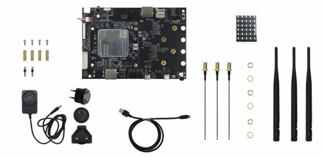
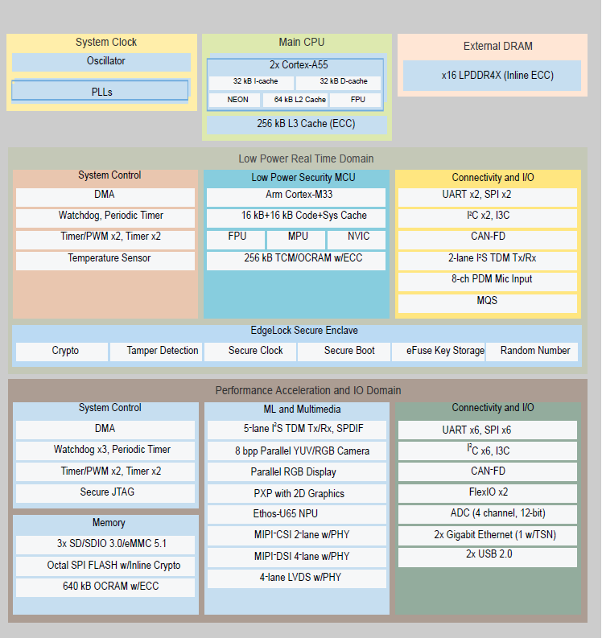

# SRG093XW EVK Linux 开发指南

 []() []() []() 

> **适用硬件：** Quectel SRG093XW EVK
>
> **最后更新：** 2026-09-19
>
> **适用对象：** Linux BSP / 驱动 / 应用开发人员 
>
> **核心内容：** 快速上手 · SDK 编译 · 镜像烧录 · 功能验证 · 网络通信 · 高级功能

## 目录

- [文档概览](#文档概览)
- [快速上手](#快速上手)
  - [开发板介绍](#开发板介绍)
  - [开发准备](#开发准备)
  - [环境搭建](#环境搭建)
  - [镜像编译](#镜像编译)
  - [镜像烧录与系统启动](#镜像烧录与系统启动)
- [功能与外设](#功能与外设)
  - [功能支持总览](#功能支持总览)
  - [显示与触摸](#显示与触摸)
  - [摄像头](#摄像头)
  - [音频](#音频)
  - [通用外设](#通用外设)
- [网络与通信](#网络与通信)
  - [Wi-Fi](#wi-fi)
  - [Bluetooth](#bluetooth)
  - [蜂窝网络](#蜂窝网络)
  - [Thread](#thread)
  - [Matter](#matter)
- [高级功能](#高级功能)
  - [Cortex-M33](#cortex-m33)
  - [Secure Boot](#secure-boot)
  - [分区调整](#分区调整)
- [FAQ](#faq)
- [修订记录](#修订记录)

---

# 文档概览

本文档介绍 **SRG093XW EVK** 的基本信息、开发环境搭建、镜像编译与烧录、主要功能及相关开发文档，为开发人员进行 SRG093XW Linux BSP 开发及功能验证提供参考。

> [!TIP]
>
> 开发板已预烧录系统镜像，可直接上电使用。预烧录镜像用于基本功能体验，具体功能支持及软件版本请以当前发布的 SDK 为准。

## 开始之前

如果你是第一次使用 SRG093XW EVK，建议按以下顺序操作：

**准备硬件 → 准备开发环境 → 获取SDK → 搭建环境 → 编译镜像 → 烧录镜像 → 启动系统 → 验证功能**

> [!TIP]
>
> 如果仅希望快速体验开发板，可跳过编译步骤，直接使用预烧录镜像完成上电和系统启动。

## 配套文档

| 分类 | 文档 | 适用内容 |
| --- | --- | --- |
| 产品规格 | [Quectel_SRG093X系列_短距离模块产品规格书](./files/Quectel_SRG093X系列_短距离模块产品规格书.pdf) | 产品规格、硬件资源、接口及主要功能 |
| 硬件设计 | [Quectel_SRG093X系列_硬件设计手册](./files/Quectel_SRG093X系列_硬件设计手册.pdf) | 引脚、电源、接口、射频及电气设计 |
| EVB 用户指导 | [Quectel_SR-IMXM_EVB_用户指导](./files/Quectel_SR-IMXM_EVB_用户指导.pdf) | 板卡布局、接口、配件、按键及开关机 |
| 编译与烧录 | Quectel_SRG091X&SRG093X系列\_Linux\_编译&烧录指导<br>TODO: 待补充编译烧录指导文件 | 开发环境、Linux 镜像编译及烧录 |
| 显示与触摸 | [Quectel_SRG091X&SRG093X系列\_Linux\_显示驱动_开发指导](./files/Quectel_SRG091X&SRG093X系列_Linux_显示驱动_开发指导.pdf) | MIPI、LVDS、触摸、背光及显示驱动 |
| 摄像头 | [Quectel_SRG093X系列\_Linux\_摄像头开发指导](./files/Quectel_SRG093X系列_Linux_摄像头开发指导.pdf) | 摄像头驱动、Device Tree 及 ISP |
| 音频 | [Quectel_SRG091X&SRG093X系列\_Linux\_音频功能测试指导](./files/Quectel_SRG091X&SRG093X系列_Linux_音频功能测试指导.pdf) | Audio Codec 及音频测试 |
| 通用外设 | [Quectel_SRG091X&SRG093X系列\_Linux\_外设用户指导](./files/Quectel_SRG091X&SRG093X系列_Linux_外设用户指导.pdf) | GPIO、I2C、SPI、Ethernet、USB、ADC、CAN |
| Wi-Fi | Quectel_SRG091X-W&SRG093X-W_Linux_Wi-Fi_功能验证指导<br/>TODO: 待补充Wi-Fi指导文件 | Wi-Fi 驱动、AP/STA 模式及功能验证 |
| Bluetooth | [Quectel_SRG091X&SRG093X系列\_Linux\_蓝牙用户指导](./files/Quectel_SRG091X&SRG093X系列_Linux_蓝牙用户指导.pdf) | Bluetooth、音频及 BLE 功能验证 |
| 蜂窝网络 | [SRG091X&SRG093X系列\_Linux\_蜂窝模块接入用户指导](./files/SRG091X&SRG093X系列_Linux_蜂窝模块接入_用户指导.pdf) | 驱动移植、网络连接及语音通话 |
| Thread | [Quectel_SRG091X&SRG093X系列\_Linux\_Thread_用户指导](./files/Quectel_SRG091X&SRG093X系列_Linux_Thread_用户指导.pdf) | Thread 启动、组网及功能验证 |
| Matter | [Quectel_SRG091X-W&SRG093X-W_Linux_Matter_用户指导](./files/Quectel_SRG091X-W&SRG093X-W_Linux_Matter_用户指导.pdf) | Ethernet、BLE + Thread、BLE + Wi-Fi Matter |
| Cortex-M33 | [Quectel_SRG093X系列\_M33\_开发指导](./files/Quectel_SRG093X系列_M33_开发指导.pdf) | M33、FreeRTOS、Zephyr、镜像编译及集成 |
| Secure Boot | [Quectel_SRG091X&SRG093X系列\_Linux\_Secure_Boot_应用指导](./files/Quectel_SRG091X&SRG093X系列_Linux_Secure_Boot_应用指导.pdf) | Secure Boot、AHAB、密钥及安全镜像 |
| 分区调整 | [Quectel_SRG091X&SRG093X系列\_Linux\_分区调整指导](./files/Quectel_SRG091X&SRG093X系列_Linux_分区调整指导.pdf) | Rootfs、Boot 及 Flash 镜像分区 |

---

# 快速上手

本章节用于完成 SRG093XW EVK 的首次使用。完成后，开发板应能够正常启动 Linux 系统，并可通过调试串口查看系统启动日志。

> [!NOTE]
>
> 本章节仅介绍基本操作流程。各功能的详细配置、开发及调试方法，请参考后续章节及对应专项开发文档。

## 开发板介绍

### 基本信息

SRG093XW EVK 是基于 NXP i.MX93 应用处理器设计的评估开发平台，用于验证 Linux BSP、显示、多媒体、无线连接、工业控制及边缘 AI 应用开发。

开发板集成 Quectel SRG093XW 核心模组，支持 Wi-Fi、Bluetooth、以太网、USB、MIPI-CSI Camera、MIPI-DSI/LVDS 显示等丰富外设接口，可满足工业 HMI、智能网关、边缘计算、视频分析及 IoT 终端等应用场景开发需求。

套件预览图：



### 系统框图



### 主要特性

| 类别 | 特性 |
| --- | --- |
| 处理器 | NXP i.MX93 双核 Arm Cortex-A55 |
| 实时控制核心 | Cortex-M33 |
| 操作系统 | Linux |
| 无线 | Wi-Fi + Bluetooth |
| 有线网络 | Gigabit Ethernet |
| 摄像头 | MIPI CSI |
| 显示 | MIPI DSI、LVDS |
| USB | USB Host / Device |
| 存储 | SD Card、eMMC Flash |
| 扩展 | PCIe |
| 工业接口 | CAN FD |
| 音频 | Audio Codec |

### KIT 套件及配件

标准套件通常包含以下内容。

> [!NOTE]
>
> KIT 套件的实际配置可能随版本变化，请以实际交付内容为准。

| 设备 | 数量 | 用途 |
| --- | ---: | --- |
| 移远通信 SRG093X-TE-A | 1 | 开发板主控板 |
| 移远通信 SR-IMXM-EVB | 1 | 开发板底板 |
| 电源适配器（5V） | 1 | 为 EVK 供电 |
| USB Type-C 数据线 | 2 | Debug UART、镜像烧录或 USB 调试 |
| 蜂窝通信模组 EG21-GL | 1 | 蜂窝网络功能测试 |
| 蜂窝天线 | 1 | 搭配蜂窝模组使用 |
| 耳机 | 1 | 音频测试 |
| 喇叭 | 1 | 音频播放测试 |
| 摄像头模组 | 1 | 图像/视频采集测试 |
| MIPI-DSI 显示屏 | 1 | MIPI 显示及触摸测试 |

硬件设计及板卡操作请分别参考：

- [Quectel_SRG093X系列_硬件设计手册](./files/Quectel_SRG093X系列_硬件设计手册.pdf)
- [Quectel_SR-IMXM_EVB_用户指导](./files/Quectel_SR-IMXM_EVB_用户指导.pdf)

## 开发准备

### 硬件准备

| 设备 | 数量 | 用途 | 必需 |
| --- | ---: | --- | :---: |
| SRG093XW-KIT 套件 | 1 | SRG093XW EVK 开发及功能验证 | 是 |
| 开发主机 | 1 | SDK 编译、镜像烧录及开发调试 | 是 |
| 网线 | 可选 | 以太网连接及网络功能测试 | 否 |
| SIM 卡 | 可选 | 蜂窝拨号上网及通话验证 | 否 |

### 软件准备

SRG093 系列 Linux BSP 开发主要需要：

- Linux 开发环境
- SDK 开发包
- 镜像烧录工具
- 可选的 Yocto 源码下载缓存包

#### Linux 开发环境

推荐使用 **Ubuntu 22.04 LTS 及以上版本**。具体环境要求请参考《Quectel_SRG091X&SRG093X系列\_Linux\_编译&烧录指导》（TODO：待补充编译烧录指导文件）。

#### SDK 开发包

SDK 包包含 SRG093 系列平台 Linux BSP 开发所需的源码、Yocto Layer、构建脚本及配置文件。

获取 `SRG093XW_SDK.tar.zst` 后，将其复制到 Ubuntu 开发主机，并按 [环境搭建](#环境搭建) 完成配置。

> **SDK 下载：** [SRG093XW_SDK.tar.zst](http://developer.quectel.com/doc/files/SRG093XW/SRG093XW_SDK.tar.zst)

#### Yocto 源码下载缓存

源码下载缓存包为**可选**软件包，可根据实际网络环境决定是否使用。

| 软件包 | 说明 | 是否必需 |
| --- | --- | :---: |
| `SRG093XW_SDK.tar.zst` | SRG093 SDK，包含 Yocto BSP 源码、Yocto Layer、编译脚本及相关工具 | 是 |
| `SRG093XW_Yocto_Downloads.tar.zst` | Yocto 编译所需源码下载缓存，用于减少编译过程中对外部网络的依赖 | 否 |

> **缓存包下载：** [SRG093XW_Yocto_Downloads.tar.zst](http://developer.quectel.com/doc/files/SRG093XW/SRG093XW_Yocto_Downloads.tar.zst)

如果使用源码下载缓存，请将缓存包解压至 SDK 的 `yocto/` 目录：

```text
SR-IMX93/
└── yocto/
    ├── sources/
    ├── downloads/
    └── ...
```

> [!TIP]
>
> - 网络环境正常时，可以**不**下载源码缓存包。
> - 网络访问受限或希望减少重复下载时，建议使用源码缓存包。
> - 新增软件包、修改 Recipe 版本或缓存不完整时，编译过程中仍可能需要下载额外源码。

#### 镜像烧录工具

| 开发环境 | 推荐方式 |
| --- | --- |
| Windows | 使用 SDK 提供的 UUU 烧录工具 |
| Linux | 根据 SDK 支持情况使用对应 UUU 工具或其他烧录方式 |

详细方法请参考 [镜像烧录与系统启动](#镜像烧录与系统启动)。

## 环境搭建

### SDK 解压

将获取到的 SRG093 SDK 软件包复制到 Ubuntu 开发主机。

**步骤 1：创建工作目录**

```bash
mkdir -p ~/SR-IMX93
```

**步骤 2：复制并解压 SDK**

```bash
cp SRG093XW_SDK.tar.zst ~/SR-IMX93/
cd ~/SR-IMX93
tar --zstd -xf SRG093XW_SDK.tar.zst
```

**步骤 3：确认 SDK 解压结果**

```bash
cd ~/SR-IMX93/yocto
ls
```

目录中应包含 `sources`、`setup-environment` 等文件和目录。

### SDK 目录结构

```text
SR-IMX93/
└── yocto/
    ├── build.sh
    ├── cst/
    ├── imx-setup-release.sh
    ├── README
    ├── README-IMXBSP
    ├── setup-environment
    ├── sources/
    │   ├── base/
    │   ├── meta-arm/
    │   ├── meta-freescale/
    │   ├── meta-freescale-distro/
    │   ├── meta-imx/
    │   ├── meta-imx-quectel-srg093x/
    │   ├── meta-nxp-connectivity/
    │   ├── meta-openembedded/
    │   ├── meta-qt6/
    │   ├── poky/
    │   └── ...
    └── uuu.exe
```

主要目录及文件说明：

| 目录 / 文件 | 说明 |
| --- | --- |
| `sources/` | Yocto BSP 源码及各 Yocto Layer |
| `sources/meta-imx/` | NXP i.MX BSP 相关 Yocto Layer |
| `sources/meta-imx-quectel-srg093x/` | SRG093 系列平台配置、Recipe、DTS 及构建脚本 |
| `sources/meta-openembedded/` | OpenEmbedded 扩展 Layer |
| `sources/meta-qt6/` | Qt 6 相关 Yocto Layer |
| `sources/poky/` | Yocto Project Poky 基础构建系统 |
| `setup-environment` | Yocto 编译环境初始化脚本 |
| `imx-setup-release.sh` | i.MX BSP 编译环境配置脚本 |
| `build.sh` | SRG093 SDK 构建辅助脚本 |
| `cst/` | NXP Code Signing Tool 相关文件 |
| `uuu.exe` | Windows 平台 UUU 烧录工具 |
| `README` / `README-IMXBSP` | BSP 相关说明文档 |

> [!NOTE]
>
> `build_srg093xw/` 是 SRG093XW 平台的 Yocto 编译目录，在初始化编译环境后生成，首次解压 SDK 时不存在。

## 镜像编译

> [!NOTE]
>
> 本章节仅介绍基本镜像编译流程。详细编译说明及错误处理请参考《Quectel_SRG091X&SRG093X系列\_Linux\_编译&烧录指导》。
>
> TODO：待补充编译烧录指导文件

### 编译完整镜像

**步骤 1：进入 Yocto 工作目录**

```bash
cd ~/SR-IMX93/yocto
```

**步骤 2：初始化 SRG093XW 编译环境**

```bash
MACHINE=quectel-srg093xw DISTRO=fsl-imx-xwayland source sources/meta-imx-quectel-srg093x/tools/imx-quectel-srg093x-setup.sh -b build_srg093xw
```

**步骤 3：确认目标平台**

```bash
bitbake-getvar MACHINE
```

预期结果：

```text
MACHINE="quectel-srg093xw"
```

**步骤 4：编译系统镜像**

```bash
bitbake <image-name>
```

其中，`<image-name>` 为 SDK 提供的系统镜像 Recipe，请根据实际发布的 SDK 配置填写。

> [!TIP]
>
> 首次编译耗时相对较长，后续编译可复用已有构建缓存。

### 查看编译产物

镜像文件位于：

```text
~/SR-IMX93/yocto/build_srg093xw/tmp/deploy/images/quectel-srg093xw/
```

查看编译产物：

```bash
ls -lh tmp/deploy/images/quectel-srg093xw/
```

> [!NOTE]
>
> 该目录包含系统镜像及相关编译产物。实际用于烧录的镜像文件请以当前 SDK 版本及《Quectel_SRG091X&SRG093X系列\_Linux\_编译&烧录指导》中的说明为准。

## 镜像烧录与系统启动

> [!CAUTION]
>
> 切换 DIP 开关前，请先将开发板供电拨码开关拨至 **OFF**，避免带电切换启动模式。

烧录镜像、烧录工具 `uuu.exe` 以及烧录脚本 `uuu.auto` 会被自动打包到 `yocto/image` 目录。

### Windows 环境烧录

**步骤 1：连接调试串口**

将开发板的 `USB-AP` 端口连接到 Windows PC。

**步骤 2：设置下载模式**

将 TE-A 板上的 DIP 开关设置为 `1000`，使模块进入串行下载模式。

**步骤 3：准备烧录文件**

将 `yocto/image/` 目录下的烧录镜像、`uuu.exe` 和 `uuu.auto` 复制至 Windows PC 的同一目录。

**步骤 4：执行烧录**

在 PowerShell / CMD 中进入烧录文件所在目录，执行：

```bash
uuu.exe uuu.auto
```

### Linux 环境烧录

使用 Linux 平台 UUU 工具进行镜像烧录，具体方式请以当前 SDK 支持情况及《Quectel_SRG091X&SRG093X系列\_Linux\_编译&烧录指导》为准。

TODO：待补充编译烧录指导文件

### 系统启动

**步骤 1：连接调试串口**

将开发板的 `DEBUG_UART` 端口连接到 Windows PC。系统将枚举出四个 COM 端口，其中 **COMA** 对应 A 核 UART 端口，是默认串口调试端口。

| 端口 | 功能 |
| --- | --- |
| USB-Enhanced-SERIAL-A | A 核 UART 端口 |
| USB-Enhanced-SERIAL-B | M 核 UART 端口 |
| USB-Enhanced-SERIAL-C | LTE UART 端口 |
| USB-Enhanced-SERIAL-D | 无其他功能 |

**步骤 2：设置启动模式**

将 TE-A 板上的 DIP 开关设置为 `0100`，进入 **eMMC Flash 启动模式**。

# 功能与外设

SRG093XW EVK 提供显示、摄像头、音频、网络及无线通信等功能。各功能的详细配置及使用方法请参考对应专项开发文档。

## 功能支持总览

| 功能 | 支持情况 | 说明 |
| --- | --- | --- |
| Ethernet | 支持 | 千兆以太网 |
| Wi-Fi | 支持 | 内置无线网络功能 |
| Bluetooth | 支持 | 内置 Bluetooth |
| 蜂窝网络 | 支持 | 支持外接蜂窝通信模块 |
| MIPI DSI | 支持 | 显示接口 |
| LVDS | 选配 | LVDS 显示 |
| Touch | 支持 | 电容触摸 |
| MIPI CSI | 支持 | Camera 输入 |
| Audio | 支持 | 音频输入/输出 |
| USB | 支持 | USB 接口 |
| UART | 支持 | 串口通信 |
| I2C | 支持 | I2C 外设通信 |
| SPI | 支持 | SPI 外设通信 |
| GPIO | 支持 | GPIO 控制 |
| ADC | 支持 | 模拟信号采集 |
| CAN | 支持 | CAN 总线通信 |

## 显示与触摸

SRG093XW EVK 支持多种显示接口及触摸功能，可用于图形界面、工业 HMI 等应用开发。

**主要支持：**

- MIPI DSI 显示
- LVDS 显示
- Touch 触摸功能
- 背光控制
- Logo 配置

**开发指导主要包含：**

- DRM 显示子系统介绍
- MIPI、RGB、LVDS 面板适配
- Device Tree 及面板驱动配置
- 背光及启动 Logo 配置
- 图像、彩条及视频显示验证

> **专项文档：** [Quectel_SRG091X&SRG093X系列\_Linux\_显示驱动_开发指导](./files/Quectel_SRG091X&SRG093X系列_Linux_显示驱动_开发指导.pdf)

## 摄像头

SRG093XW EVK 支持 MIPI CSI 摄像头接口，可用于图像采集、视频处理及视觉应用开发。

**开发指导主要包含：**

- 摄像头驱动源码
- Device Tree 配置
- AP1302 ISP 固件配置

> **专项文档：** [Quectel_SRG093X系列\_Linux\_摄像头开发指导](./files/Quectel_SRG093X系列_Linux_摄像头开发指导.pdf)

## 音频

SRG093XW EVK 支持音频输入/输出功能，可用于音频播放、录音及相关应用开发。

**功能指导主要包含：**

- 音频相关软件编译与烧录
- Audio Codec 功能测试

> **专项文档：** [Quectel_SRG091X&SRG093X系列\_Linux\_音频功能测试指导](./files/Quectel_SRG091X&SRG093X系列_Linux_音频功能测试指导.pdf)

## 通用外设

SRG093XW EVK 提供多种通用外设接口，可用于设备连接、数据采集及通信等应用开发。

**支持接口：**

- GPIO
- I2C
- SPI
- Ethernet
- USB
- ADC
- CAN

**外设用户指导主要包含：**

- GPIO 配置及功能测试
- I2C 接口使用
- SPI 配置及功能测试
- Ethernet 功能使用
- USB 配置及工作模式
- ADC 配置及电压采集
- CAN 功能使用

> **专项文档：** [Quectel_SRG091X&SRG093X系列\_Linux\_外设用户指导](./files/Quectel_SRG091X&SRG093X系列_Linux_外设用户指导.pdf)

# 网络与通信

SRG093XW EVK 支持 Wi-Fi、Bluetooth、蜂窝网络等网络与无线通信功能，并支持 Thread、Matter 等物联网应用。

## Wi-Fi

SRG093XW EVK 内置 Wi-Fi 功能，可用于无线网络连接及相关应用开发。

**功能验证指导主要包含：**

- Wi-Fi 驱动加载
- Wi-Fi AP 模式配置及功能验证
- IEEE 802.11n/802.11ac 无线标准模式配置
- Wi-Fi 加密模式配置
- Wi-Fi STA 模式配置及功能验证
- STA 模式下连接加密及非加密 AP

> **专项文档：** 《Quectel_SRG091X-W&SRG093X-W_Linux_Wi-Fi_功能验证指导》
>
> TODO：补充Wi-Fi指导文件。

## Bluetooth

SRG093XW EVK 内置 Bluetooth 功能，可用于蓝牙设备连接、音频传输及低功耗蓝牙等应用开发。

**用户指导主要包含：**

- Bluetooth 驱动加载及基本功能验证
- Bluetooth 音频 Sink/Source 功能验证
- PipeWire 蓝牙音频服务配置
- BLE Server 功能验证
- BLE Client 功能验证
- BLE 数据读写测试

> **专项文档：** [Quectel_SRG091X&SRG093X系列\_Linux\_蓝牙用户指导](./files/Quectel_SRG091X&SRG093X系列_Linux_蓝牙用户指导.pdf)

## 蜂窝网络

SRG093XW EVK 支持外接蜂窝通信模块，可用于蜂窝网络连接、数据通信及语音通话等应用开发。

**开发指导主要包含：**

- 蜂窝模块 USB 转串口及 USB 网络驱动移植
- QMI_WWAN、ECM 网络驱动配置
- QConnectManager 移植及配置
- 蜂窝网络上网功能验证
- 语音通话功能配置及验证

> **专项文档：** [SRG091X&SRG093X系列\_Linux\_蜂窝模块接入用户指导](./files/SRG091X&SRG093X系列_Linux_蜂窝模块接入_用户指导.pdf)

**相关参考文档：**

- [Quectel_UMTS_LTE_5G_Linux_USB_Driver_用户指导](./files/reference/Quectel_UMTS_LTE_5G_Linux_USB_Driver_用户指导_V1.2.pdf)
- [Quectel_EC2x&EG2x&EG9x&EM05_Series_AT_Commands_Manual](./files/reference/Quectel_EC2x&EG2x&EG9x&EM05_Series_AT_Commands_Manual_V2.2.pdf)
- [Quectel_QConnectManager_Linux_用户指导](./files/Quectel_QConnectManager_Linux_用户指导_V1.0.pdf)

## Thread

SRG093XW EVK 支持 Thread 网络功能，可用于低功耗物联网设备组网及相关应用开发。

**用户指导主要包含：**

- Thread 功能启动
- Thread 网络创建及配置
- Thread 网络连接及功能验证

> **专项文档：** [Quectel\_SRG091X&SRG093X系列\_Linux\_Thread\_用户指导](./files/Quectel_SRG091X&SRG093X系列_Linux_Thread_用户指导.pdf)

## Matter

SRG093XW EVK 支持 Matter 相关应用开发，可通过多种网络连接方式进行 Matter 设备配网及功能验证。

**用户指导主要包含：**

- 基于 Ethernet 的 Matter 功能验证
- 基于 BLE + Thread 的 Matter 功能验证
- 基于 BLE + Wi-Fi 的 Matter 功能验证

> **专项文档：** [Quectel_SRG091X-W&SRG093X-W_Linux_Matter_用户指导](./files/Quectel_SRG091X-W&SRG093X-W_Linux_Matter_用户指导.pdf)

# 高级功能

SRG093XW 平台支持 Cortex-M33 实时处理、安全启动及系统分区调整等高级功能，可满足实时控制、系统安全及存储配置等应用需求。

## Cortex-M33

SRG093XW 平台集成 Cortex-M33 实时处理器，可用于实时控制及相关应用开发，并支持 FreeRTOS 和 Zephyr 开发环境。

**开发指导主要包含：**

- M33 核硬件及调试串口介绍
- U-Boot 及 Linux 内核阶段启动 M33 核
- FreeRTOS 开发及 M33 镜像编译
- Zephyr 开发环境搭建及镜像编译
- M33 镜像集成及启动验证

> **专项文档：** [Quectel\_SRG093X系列\_M33\_开发指导](./files/Quectel_SRG093X系列_M33_开发指导.pdf)

## Secure Boot

SRG093XW 平台支持 Secure Boot，可通过镜像认证机制提升系统启动过程的安全性。

**应用指导主要包含：**

- AHAB 安全启动机制介绍
- Secure Boot 使能及镜像生成
- PKI 密钥树及 SRK 表生成
- 安全镜像烧录及启动验证
- SRK 哈希值 eFuse 烧录
- CST 工具使用及密钥生成

> **专项文档：** [Quectel\_SRG091X&SRG093X系列\_Linux\_Secure\_Boot\_应用指导](./files/Quectel_SRG091X&SRG093X系列_Linux_Secure_Boot_应用指导.pdf)

## 分区调整

SRG093XW Linux BSP 支持根据实际应用需求调整系统镜像分区及分区大小，以满足不同存储空间配置需求。

**指导内容主要包含：**

- 系统镜像布局介绍
- Rootfs 分区大小调整
- Boot 分区大小调整
- Flash 镜像分区配置

> **专项文档：** [Quectel\_SRG091X&SRG093X系列\_Linux\_分区调整指导](./files/Quectel_SRG091X&SRG093X系列_Linux_分区调整指导.pdf)

# FAQ

参考文档：[FAQ](./FAQ.md)

# 修订记录

| 版本 | 日期 | 修订内容 |
| --- | --- | --- |
| V1.0.0 | 2026-09-18 | 初始版本 |
| V1.0.1 | 2026-09-19 | 基于用户体验优化文档：<br/>- 增加文档目录<br/>- 按照开发者任务阅读路径重新组织文档信息 |
